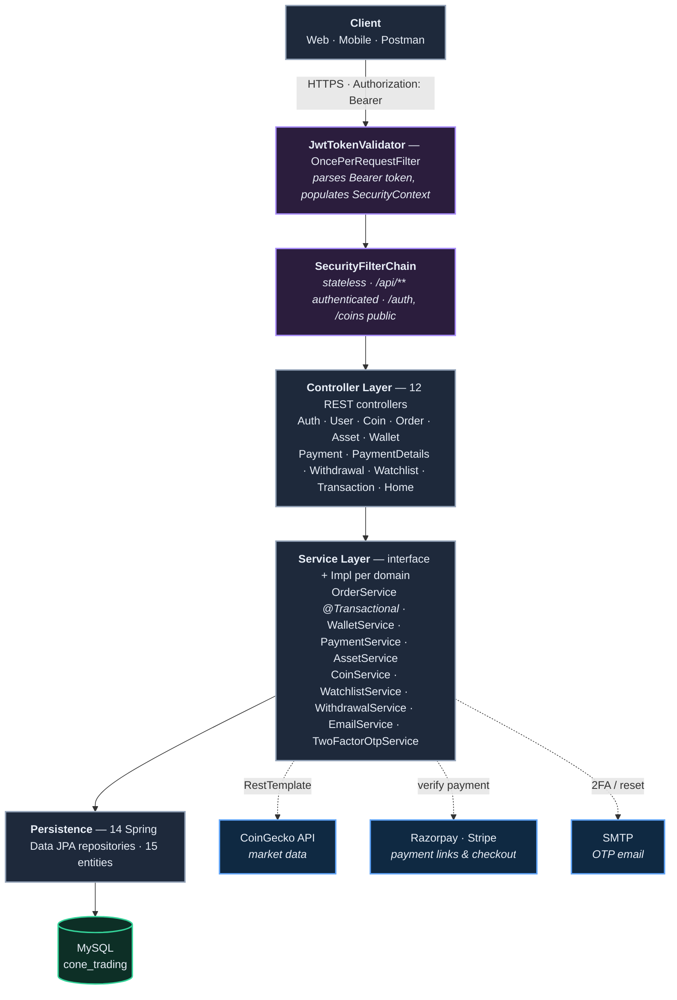
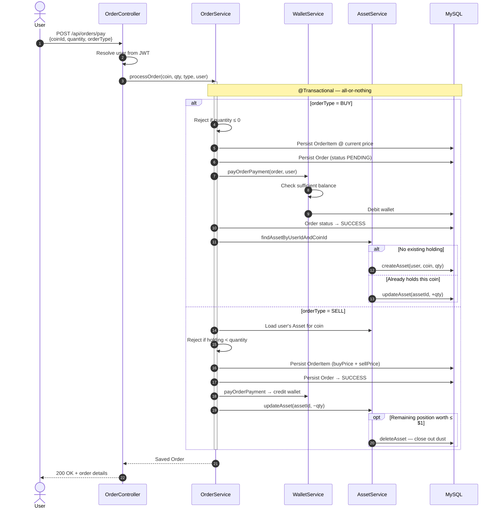
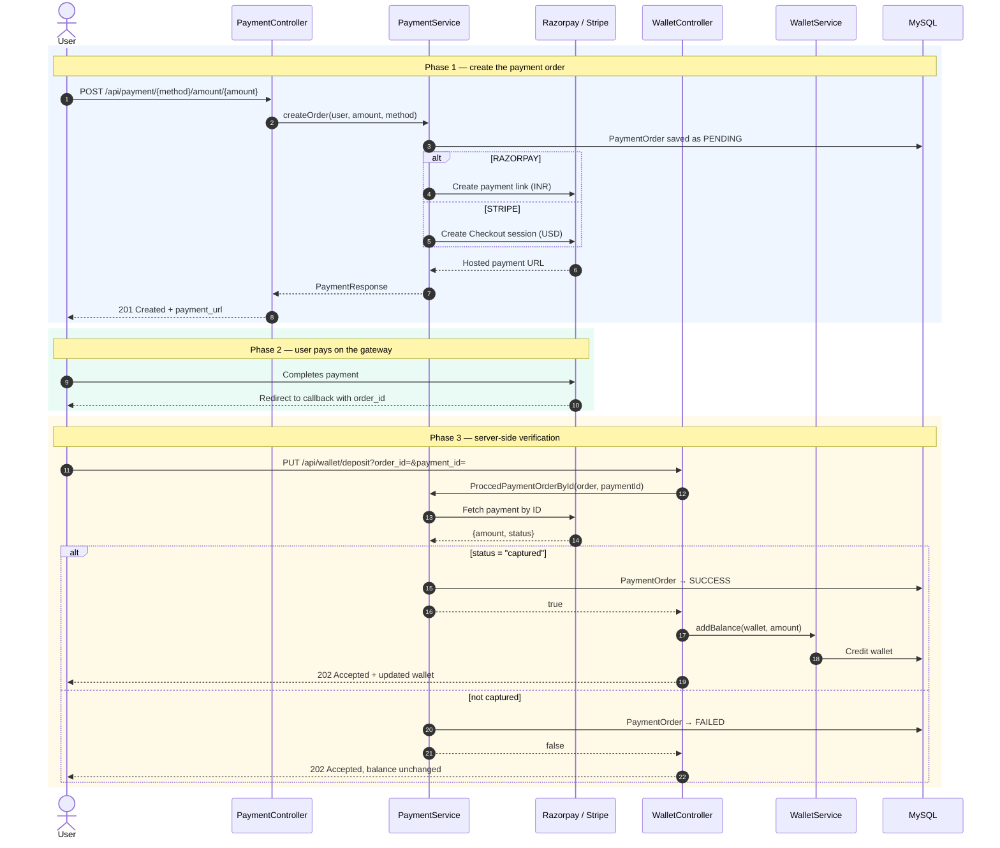
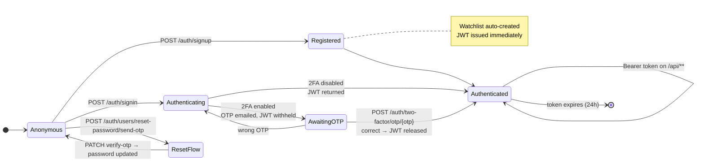
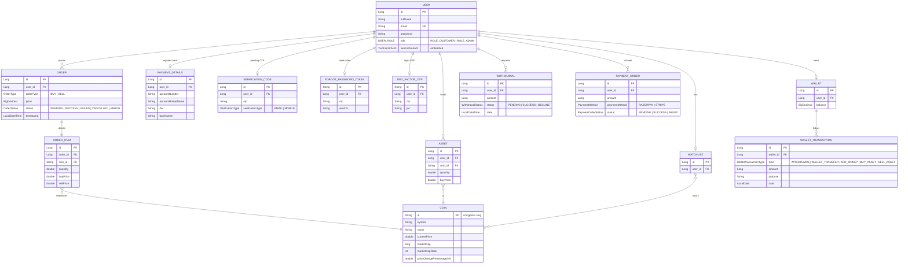

<div align="center">

# Cone Trading

**A crypto trading backend built with Spring Boot — real market data, a custodial wallet, and dual payment gateways.**

Users sign up, fund a wallet through Razorpay or Stripe, buy and sell cryptocurrencies at live CoinGecko prices, track a portfolio, and withdraw to a bank account. Every state change — orders, holdings, balances, withdrawals — is persisted and reconciled server-side.

[](https://openjdk.org/)
[](https://spring.io/projects/spring-boot)
[](https://spring.io/projects/spring-security)
[](https://www.mysql.com/)
[](https://razorpay.com/)
[](https://stripe.com/)
[](https://www.coingecko.com/en/api)

`REST API` · `40+ endpoints` · `15 JPA entities` · `Stateless JWT auth` · `Email 2FA`

</div>

---

## Contents

- [What it does](#what-it-does)
- [Architecture](#architecture)
- [How trading works](#how-trading-works)
- [How wallet top-up works](#how-wallet-top-up-works)
- [Authentication & 2FA](#authentication--2fa)
- [Data model](#data-model)
- [API reference](#api-reference)
- [Tech stack](#tech-stack)
- [Running it locally](#running-it-locally)
- [Project structure](#project-structure)
- [Design notes & limitations](#design-notes--limitations)

---

## What it does

| Domain | Capability |
|---|---|
| **Market data** | Live coin listings, per-coin detail, OHLC market charts, keyword search, top-50 by market cap, and trending coins — proxied from the CoinGecko API |
| **Trading** | `BUY` / `SELL` order execution against live prices, with transactional wallet debit/credit and automatic portfolio reconciliation |
| **Portfolio** | Asset holdings per user per coin, auto-created on first buy, auto-updated on every trade, auto-deleted when a position falls below \$1 |
| **Wallet** | Balance tracking, wallet-to-wallet transfers, order settlement, and gateway-verified deposits |
| **Payments** | Razorpay payment links (INR) and Stripe Checkout sessions (USD), with server-side payment verification before any balance is credited |
| **Withdrawals** | User withdrawal requests against bank details, plus an admin approve/decline flow that refunds the wallet on rejection |
| **Watchlist** | A per-user watchlist, provisioned automatically at signup, with coins toggled in and out |
| **Auth** | Stateless JWT issuance and validation, optional email-OTP two-factor login, OTP-based password reset, and `ROLE_CUSTOMER` / `ROLE_ADMIN` separation |

---

## Architecture

A conventional layered Spring Boot service: controllers handle HTTP, services own the business rules, repositories talk to MySQL through JPA. A servlet filter authenticates every `/api/**` request before it reaches a controller.



---

## How trading works

Placing an order is the most involved path in the system. `OrderService.processOrder` runs inside a single `@Transactional` boundary so that the order record, the wallet debit, and the portfolio update either all commit or all roll back — a partial write would leave a user's balance and holdings out of sync.



Two details worth calling out:

- **Sell orders record both prices.** The `OrderItem` stores the original `buyPrice` alongside the `sellPrice`, so realised profit and loss is derivable from order history rather than recomputed from a moving market price.
- **Dust positions are closed automatically.** If a sale leaves a holding worth a dollar or less, the asset row is deleted instead of lingering as an unsellable fragment.

---

## How wallet top-up works

Money never enters a wallet on the client's say-so. The client only ever receives a payment *link*; the balance moves in a separate, authenticated call where the server independently re-fetches the payment from the gateway and confirms it was actually captured.



The same principle governs withdrawals in reverse: a request debits the wallet immediately and creates a `PENDING` withdrawal, and if an admin later declines it, the amount is credited back.

---

## Authentication & 2FA

Auth is stateless — no server session. `JwtTokenValidator` runs ahead of Spring Security's `BasicAuthenticationFilter`, parses the `Authorization: Bearer <token>` header, and populates the `SecurityContext` with the email and authorities carried in the token's claims. Tokens are HMAC-SHA signed and valid for 24 hours.

When a user has two-factor enabled, sign-in doesn't return a usable token directly. The JWT is generated but held server-side against a one-time OTP emailed to the user; only after that OTP is verified is the token released.



Enabling 2FA is itself OTP-gated: a user requests a code at `/api/users/verification/EMAIL/send-otp`, then confirms it at `/api/users/enable-two-factor/verify-otp/{otp}`.

---

## Data model

Fifteen JPA entities. `User` is the hub — wallet, watchlist, payment details and two-factor settings hang off it one-to-one, while orders, assets, withdrawals and payment orders are one-to-many.



The schema is generated by Hibernate (`ddl-auto=update`), so no migration files are checked in.

---

## API reference

Base URL: `http://localhost:5454`

Every route under `/api/**` requires an `Authorization: Bearer <jwt>` header. Routes under `/auth/**` and `/coins/**` are public.

### Authentication

| Method | Endpoint | Description |
|---|---|---|
| `POST` | `/auth/signup` | Register a user, auto-create their watchlist, return a JWT |
| `POST` | `/auth/signin` | Sign in — returns a JWT, or triggers an OTP email if 2FA is on |
| `POST` | `/auth/two-factor/otp/{otp}?id={sessionId}` | Verify the login OTP and release the withheld JWT |
| `POST` | `/auth/users/reset-password/send-otp` | Send a password-reset OTP |
| `PATCH` | `/auth/users/reset-password/verify-otp?id={tokenId}` | Verify the OTP and set a new password |

### User

| Method | Endpoint | Description |
|---|---|---|
| `GET` | `/api/users/profile` | Resolve the current user from the JWT |
| `POST` | `/api/users/verification/{EMAIL\|MOBILE}/send-otp` | Send a verification OTP for enabling 2FA |
| `PATCH` | `/api/users/enable-two-factor/verify-otp/{otp}` | Confirm the OTP and switch 2FA on |

### Market data — public

| Method | Endpoint | Description |
|---|---|---|
| `GET` | `/coins?page={n}` | Paginated coin list (10 per page) |
| `GET` | `/coins/{coinId}/chart?days={n}` | Historical market chart data |
| `GET` | `/coins/search?q={keyword}` | Search coins by keyword |
| `GET` | `/coins/top50` | Top 50 coins by market-cap rank |
| `GET` | `/coins/trading` | Currently trending coins |
| `GET` | `/coins/details/{coinId}` | Full coin detail — also upserts the coin locally |

### Orders

| Method | Endpoint | Description |
|---|---|---|
| `POST` | `/api/orders/pay` | Execute a `BUY` or `SELL` order |
| `GET` | `/api/orders/{orderId}` | Fetch one order — ownership enforced |
| `GET` | `/api/orders` | List the caller's orders |

### Portfolio

| Method | Endpoint | Description |
|---|---|---|
| `GET` | `/api/asset` | All holdings for the current user |
| `GET` | `/api/asset/{assetId}` | A single holding by ID |
| `GET` | `/api/asset/coin/{coinId}/user` | The caller's holding in one specific coin |

### Wallet & transactions

| Method | Endpoint | Description |
|---|---|---|
| `GET` | `/api/wallet` | Current wallet — created on first access |
| `PUT` | `/api/wallet/{walletId}/transfer` | Transfer funds to another user's wallet |
| `PUT` | `/api/wallet/order/{orderId}/pay` | Settle an order against the wallet |
| `PUT` | `/api/wallet/deposit?order_id=&payment_id=` | Verify a gateway payment and credit the balance |
| `GET` | `/api/transactions` | Wallet transaction ledger |

### Payments

| Method | Endpoint | Description |
|---|---|---|
| `POST` | `/api/payment/{RAZORPAY\|STRIPE}/amount/{amount}` | Create a payment order and return a hosted payment URL |
| `POST` | `/api/payment-details` | Save bank details for withdrawals |
| `GET` | `/api/payment-details` | Retrieve saved bank details |

### Withdrawals

| Method | Endpoint | Description |
|---|---|---|
| `POST` | `/api/withdrawal/{amount}` | Request a withdrawal — debits wallet, logs a transaction |
| `GET` | `/api/withdrawal` | The caller's withdrawal history |
| `GET` | `/api/admin/withdrawal` | **Admin** — all pending withdrawal requests |
| `PATCH` | `/api/admin/withdrawal/{id}/proceed/{accept}` | **Admin** — approve or decline; declining refunds the wallet |

### Watchlist

| Method | Endpoint | Description |
|---|---|---|
| `GET` | `/api/watchlist/user` | The caller's watchlist |
| `GET` | `/api/watchlist/{watchlistId}` | A watchlist by ID |
| `PATCH` | `/api/watchlist/add/coin/{coinId}` | Toggle a coin in or out of the watchlist |

<details>
<summary><b>Example — buy 0.5 BTC</b></summary>

```bash
# 1. Sign in
curl -X POST http://localhost:5454/auth/signin \
  -H "Content-Type: application/json" \
  -d '{"email":"trader@example.com","password":"secret"}'
# → { "jwt": "eyJhbGciOi...", "status": true, "message": "login success" }

# 2. Make sure the coin exists locally (details endpoint upserts it)
curl http://localhost:5454/coins/details/bitcoin

# 3. Place the order
curl -X POST http://localhost:5454/api/orders/pay \
  -H "Authorization: Bearer eyJhbGciOi..." \
  -H "Content-Type: application/json" \
  -d '{"coinId":"bitcoin","quantity":0.5,"orderType":"BUY"}'

# 4. Check the resulting portfolio
curl http://localhost:5454/api/asset \
  -H "Authorization: Bearer eyJhbGciOi..."
```

</details>

---

## Tech stack

| Layer | Choice | Why |
|---|---|---|
| Language | Java 17 | LTS baseline required by Spring Boot 3.x |
| Framework | Spring Boot 3.4.2 | Auto-configuration, embedded Tomcat, starter ecosystem |
| Security | Spring Security + JJWT 0.11.2 | Stateless HMAC-signed tokens, no session store to scale |
| Persistence | Spring Data JPA / Hibernate | Repository abstraction over a relational schema with real referential integrity |
| Database | MySQL 8 | Financial records need ACID transactions — a document store would be the wrong tool here |
| Payments | Razorpay 1.4.8 · Stripe 28.2.0 | INR and USD rails behind one `PaymentMethod` enum |
| Market data | CoinGecko API via `RestTemplate` | Free, keyless, broad coin coverage |
| Email | Spring Boot Mail | OTP delivery for 2FA and password reset |
| Boilerplate | Lombok 1.18.24 | Keeps 15 entities readable |
| Build | Maven (wrapper included) | Reproducible builds without a local Maven install |

---

## Running it locally

**Prerequisites** — JDK 17+, MySQL 8+, and a Razorpay and/or Stripe test account.

**1. Clone and create the database**

```bash
git clone https://github.com/chinmoypaul8897/Cone-Trading.git
cd Cone-Trading
mysql -u root -p -e "CREATE DATABASE cone_trading;"
```

Hibernate creates every table on first boot — no migration step needed.

**2. Configure credentials**

Copy the template and fill in your own values:

```bash
cp .env.example .env
```

```properties
DB_PASSWORD=your_mysql_password
RAZORPAY_API_KEY=rzp_test_xxxxxxxxxxxxxx
RAZORPAY_API_SECRET=your_razorpay_secret
STRIPE_API_KEY=sk_test_xxxxxxxxxxxxxx
```

Nothing sensitive is committed — [`application.properties`](src/main/resources/application.properties) reads every credential from the environment. Export them before running:

```bash
# macOS / Linux
export $(grep -v '^#' .env | xargs)

# Windows PowerShell
Get-Content .env | Where-Object { $_ -notmatch '^#' -and $_ } | ForEach-Object {
    $k, $v = $_ -split '=', 2; Set-Item -Path "env:$k" -Value $v
}
```

**3. Run**

```bash
./mvnw spring-boot:run          # macOS / Linux
mvnw.cmd spring-boot:run        # Windows
```

The API comes up on **`http://localhost:5454`**. Confirm it's alive:

```bash
curl http://localhost:5454
# → Welcome to cone trading
```

**4. Build a JAR**

```bash
./mvnw clean package
java -jar target/trading-0.0.1-SNAPSHOT.jar
```

> **Payment callbacks** point at `http://localhost:5173` (a Vite dev server) — change the `callback_url` and `setSuccessUrl` values in [`PaymentServiceImpl`](src/main/java/com/cone/trading/service/PaymentServiceImpl.java) if your client runs elsewhere.

---

## Project structure

```
src/main/java/com/cone/trading/
├── config/          # Security filter chain, JWT provider, token filter
├── controller/      # 12 REST controllers — the HTTP surface
├── domain/          # 8 enums: OrderType, OrderStatus, PaymentMethod, USER_ROLE, …
├── model/           # 15 JPA entities
├── repository/      # 14 Spring Data repositories
├── request/         # Inbound DTOs
├── response/        # Outbound DTOs — ApiResponse, AuthResponse, PaymentResponse
├── service/         # Business logic — interface + Impl per domain
└── utils/           # OTP generation
```

The `service` package follows an interface-plus-implementation split throughout (`OrderService` / `OrderServiceImpl`), so controllers depend on contracts rather than concrete classes and any implementation can be swapped without touching the web layer.

---

## Design notes & limitations

This is a portfolio project built to work through the mechanics of a real trading backend end to end. A few decisions and known gaps, stated plainly:

**Deliberate choices**

- **Orders are transactional.** Order creation, wallet movement and asset reconciliation share one `@Transactional` boundary — a crash mid-order can't leave a debited wallet with no holding to show for it.
- **Payments are verified server-side.** The client never tells the server how much to credit; the server re-fetches the payment from the gateway and checks for `captured` before touching a balance.
- **Balances use `BigDecimal`.** Floating-point money is a well-known way to lose cents at scale.
- **Coins are cached locally.** `/coins/details/{coinId}` upserts the coin into MySQL, so orders reference a stable local row rather than depending on a live CoinGecko call at execution time.

**Known limitations**

- **Passwords are stored and compared in plaintext.** A `BCryptPasswordEncoder` on registration and an `AuthenticationProvider` at sign-in is the correct fix — this is the first thing to change before anything resembling production use.
- **CORS is not configured.** `AppConfig.corsConfigurationSource()` returns `null`, so a browser client on another origin will be blocked. It needs a real `CorsConfiguration` with allowed origins.
- **`EmailService` has no injected `JavaMailSender`** and no SMTP properties are set, so OTP emails will fail until mail config is added — the OTP itself is still generated and persisted.
- **Admin endpoints aren't role-gated.** `/api/admin/**` authenticates the caller but never checks for `ROLE_ADMIN`; that needs `.requestMatchers("/api/admin/**").hasRole("ADMIN")` in the filter chain.
- **No automated tests.** Only the generated context-load test exists. The order and payment flows are the obvious first candidates for coverage.
- **Order filtering is unimplemented.** `GET /api/orders` accepts `order_type` and `asset_symbol` query params, but `getAllOrderOfUser` currently ignores both and returns all of the user's orders.
- **No rate limiting on CoinGecko calls.** The free tier is rate-limited; a caching layer would matter under real traffic.

---

<div align="center">

**Chinmoy Paul**

[](https://github.com/chinmoypaul8897)

</div>
